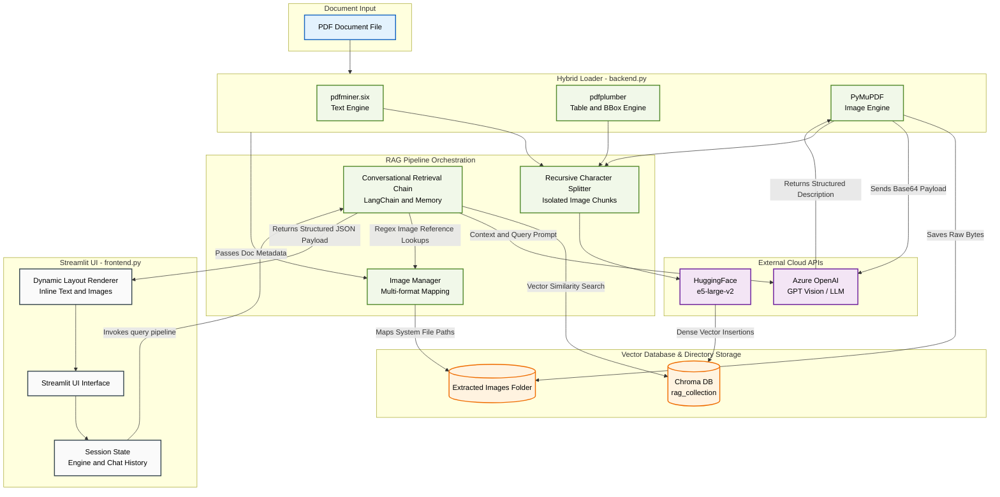

# VisiRAG

VisiRAG (**Visual Retrieval-Augmented Generation**) is a multimodal RAG system that allows users to upload PDFs containing text, tables, and images, and then interactively query the documents. The system retrieves relevant information and generates responses enriched with both text and images, providing a seamless multimodal experience.

The project is split into two main components:

* [`backend.py`](https://www.google.com/search?q=backend.py) – Handles PDF parsing, image extraction, embeddings, vector store creation, and query processing with LangChain and Azure OpenAI.
* [`frontend.py`](https://www.google.com/search?q=frontend.py) – A Streamlit-based user interface for uploading PDFs, chatting with the RAG engine, and viewing inline images in responses.

---

## ✨ Features

* 📄 **PDF ingestion**: Extracts text, tables, and images from PDFs using PyMuPDF, pdfplumber, and pdfminer.
* 🖼 **Image descriptions**: Generates AI-powered descriptions for extracted images (via Azure OpenAI).
* 🔍 **Semantic search**: Uses HuggingFace embeddings with Chroma vector store for retrieval.
* 🤖 **RAG workflow**: Combines document retrieval with Azure OpenAI’s LLM for contextual answers.
* 💬 **Conversational memory**: Maintains chat history for context-aware conversations.
* 🎨 **Streamlit UI**: Upload PDFs, ask questions, and view inline images in responses interactively.

---

## 📐 System Architecture

The workflow engine coordinates file ingestion, external model indexing, state tracking, and UI compilation across a decoupled framework:



---

## ⚡ Installation

Clone this repository:

```bash
git clone https://github.com/your-username/VisiRAG.git
cd VisiRAG

```

Create and activate a virtual environment:

```bash
python -m venv venv
source venv/bin/activate   # On Linux/Mac
venv\Scripts\activate      # On Windows

```

Install dependencies with **uv**:

```bash
uv pip install -e .

```

Or, if you don’t want editable mode:

```bash
uv pip install .

```

This will install everything defined in your `pyproject.toml`.

> **Note:** Make sure you have Python **3.12** installed.

---

## 🔑 Environment Variables

Before running, create a `.env` file in the root directory with the following:

```env
AZURE_OPENAI_DEPLOYMENT_NAME=your-deployment
AZURE_OPENAI_API_KEY=your-api-key
AZURE_OPENAI_API_VERSION=your-api-version
AZURE_OPENAI_ENDPOINT=https://your-resource.openai.azure.com/

```

---

## 🚀 Usage

Run the Streamlit frontend:

```bash
streamlit run frontend.py

```

Steps:

1. Upload a PDF file.
2. Ask natural language questions about the content.
3. View responses with inline text and extracted images.

---

## 🗂 Project Structure

```text
VisiRAG/
│── .env              # Environment variables
│── .python-version   # Python version specification
│── LICENSE           # License file
│── backend.py        # Core RAG engine (PDF processing, embeddings, query handling)
│── frontend.py       # Streamlit-based chat UI
│── pyproject.toml    # Project dependencies and metadata
│── uv.lock           # Lockfile for reproducible installs
│── README.md         # Project documentation

```

---

## 📜 MIT License

```text
MIT License

Copyright (c) 2025 Aadarsh Pandey D

Permission is hereby granted, free of charge, to any person obtaining a copy
of this software and associated documentation files (the "Software"), to deal
in the Software without restriction, including without limitation the rights
to use, copy, modify, merge, publish, distribute, sublicense, and/or sell
copies of the Software, and to permit persons to whom the Software is
furnished to do so, subject to the following conditions:

The above copyright notice and this permission notice shall be included in
all copies or substantial portions of the Software.

THE SOFTWARE IS PROVIDED "AS IS", WITHOUT WARRANTY OF ANY KIND, EXPRESS OR
IMPLIED, INCLUDING BUT NOT LIMITED TO THE WARRANTIES OF MERCHANTABILITY,
FITNESS FOR A PARTICULAR PURPOSE AND NONINFRINGEMENT. IN NO EVENT SHALL THE
AUTHORS OR COPYRIGHT HOLDERS BE LIABLE FOR ANY CLAIM, DAMAGES OR OTHER
LIABILITY, WHETHER IN AN ACTION OF CONTRACT, TORT OR OTHERWISE, ARISING FROM,
OUT OF OR IN CONNECTION WITH THE SOFTWARE OR THE USE OR OTHER DEALINGS IN
THE SOFTWARE.

```

---

## 🙌 Acknowledgments

* LangChain
* Streamlit
* Chroma
* Azure OpenAI
* PyMuPDF
* [pdfplumber]()
* [pdfminer.six]()
